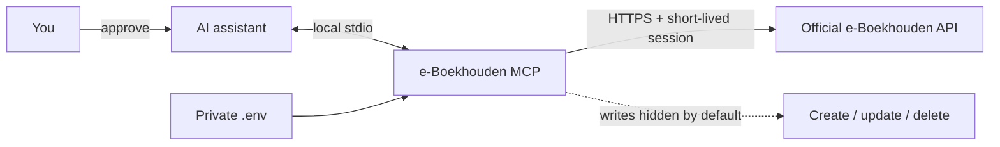

<p align="center">
  
</p>

<h1 align="center">e-Boekhouden MCP</h1>

<p align="center">
  A secure, local Model Context Protocol server for your own e-Boekhouden administration.
</p>

<p align="center">
  <a href="https://github.com/matisup10/e-Boekhouden-MCP/actions/workflows/ci.yml"></a>
  <a href="https://github.com/matisup10/e-Boekhouden-MCP/actions/workflows/codeql.yml"></a>
  
  
  <a href="LICENSE"></a>
</p>

<p align="center">
  <a href="#quick-start">Quick start</a> ·
  <a href="#connect-an-ai-assistant">AI assistants</a> ·
  <a href="#tools">Tools</a> ·
  <a href="#safety-model">Safety</a> ·
  <a href="docs/development.md">Contributing</a>
</p>

Connect Claude, ChatGPT desktop, Codex, Cursor, VS Code, Windsurf, Gemini CLI,
or any local MCP client directly to the official e-Boekhouden API. The server
runs on your machine over stdio: there is no hosted middleman, shared account,
or bundled credential.

> [!IMPORTANT]
> Bring your own e-Boekhouden API token. This independent community project is
> not affiliated with or endorsed by e-Boekhouden.nl.

## Why this server

| | Behavior |
|---|---|
| **Local by design** | Your MCP client launches one local process; no port is opened. |
| **Read-only first** | 34 search, detail, and reporting tools are available by default. |
| **Writes have two locks** | The operator enables writes, then every call requires explicit `confirm: true`. |
| **Strict inputs** | Unknown fields, invalid pagination, malformed rows, and oversized batches are rejected before API access. |
| **Official host guard** | Credentials only go to `api.e-boekhouden.nl` unless a trusted custom HTTPS host is deliberately allowed. |
| **Useful at scale** | Compact search, capped batch hydration, financial reports, aging, VAT, and ledger transaction tools are included. |

## Quick start

### 1. Install

Requirements: Python 3.10+ and [`uv`](https://docs.astral.sh/uv/) or `pipx`.

```bash
uv tool install git+https://github.com/matisup10/e-Boekhouden-MCP.git
```

With pipx:

```bash
pipx install 'git+https://github.com/matisup10/e-Boekhouden-MCP.git'
```

### 2. Store your token outside a repository

macOS and Linux:

```bash
mkdir -p ~/.config/eboekhouden-mcp
chmod 700 ~/.config/eboekhouden-mcp
printf '%s\n' 'EBOEKHOUDEN_MCP_SECRET_TOKEN=replace-with-your-own-token' \
  > ~/.config/eboekhouden-mcp/.env
chmod 600 ~/.config/eboekhouden-mcp/.env
```

Windows PowerShell:

```powershell
$configDir = Join-Path $env:USERPROFILE ".config\eboekhouden-mcp"
New-Item -ItemType Directory -Force $configDir
notepad (Join-Path $configDir ".env")
```

Add `EBOEKHOUDEN_MCP_SECRET_TOKEN=replace-with-your-own-token`, replacing the
placeholder with the token for your administration.

### 3. Validate without contacting the API

```bash
cd ~/.config/eboekhouden-mcp
eboekhouden-mcp --check-config
command -v eboekhouden-mcp
```

PowerShell equivalents:

```powershell
Push-Location $configDir
eboekhouden-mcp --check-config
Pop-Location
(Get-Command eboekhouden-mcp).Source
```

Use the printed absolute executable path in your MCP client. GUI apps often do
not inherit the same `PATH` as a terminal.

## Connect an AI assistant

The common stdio definition works in Claude Desktop, Cursor, Windsurf, and
Gemini CLI. Replace both paths with absolute paths:

```json
{
  "mcpServers": {
    "eboekhouden": {
      "command": "/absolute/path/to/eboekhouden-mcp",
      "args": [],
      "cwd": "/absolute/path/to/.config/eboekhouden-mcp"
    }
  }
}
```

| Assistant | Put the server definition here |
|---|---|
| **Claude Desktop** | Developer settings, or `claude_desktop_config.json` |
| **Claude Code** | `claude mcp add-json --scope user ...` |
| **ChatGPT desktop / Codex app** | `~/.codex/config.toml` |
| **Codex CLI / IDE extension** | `~/.codex/config.toml` |
| **Cursor** | `~/.cursor/mcp.json` |
| **VS Code + GitHub Copilot** | User or workspace `mcp.json` |
| **Windsurf** | `~/.codeium/windsurf/mcp_config.json` |
| **Gemini CLI** | `~/.gemini/settings.json` |

### Claude Code

```bash
claude mcp add-json --scope user eboekhouden \
  '{"type":"stdio","command":"/absolute/path/to/eboekhouden-mcp","args":[],"cwd":"/absolute/path/to/.config/eboekhouden-mcp"}'
claude mcp list
```

### ChatGPT desktop and Codex

The ChatGPT desktop app, Codex app, CLI, and IDE extension use Codex
`config.toml`. Add:

```toml
[mcp_servers.eboekhouden]
command = "/absolute/path/to/eboekhouden-mcp"
cwd = "/absolute/path/to/.config/eboekhouden-mcp"
```

Restart the app or extension. In the CLI, run `codex mcp list` or open `/mcp`.
ChatGPT on the web cannot launch a local stdio process; this repository does not
ship a remote multi-user deployment.

### VS Code with GitHub Copilot

Run **MCP: Open User Configuration** and use `envFile` so the token stays out of
`mcp.json`:

```json
{
  "servers": {
    "eboekhouden": {
      "type": "stdio",
      "command": "/absolute/path/to/eboekhouden-mcp",
      "args": [],
      "envFile": "/absolute/path/to/.config/eboekhouden-mcp/.env"
    }
  }
}
```

The complete client-by-client guide, exact file locations, Windows notes, and
troubleshooting live in **[AI assistant integrations](docs/integrations.md)**.

## Safety model



- The secret is loaded from your process environment or a private `.env`.
- Config errors and representations do not print the token.
- API sessions are refreshed safely and serialized across concurrent calls.
- Tool schemas reject unknown properties and enforce official API bounds.
- MCP annotations identify read-only and destructive operations.
- The optional archive sender is separately disabled, path-allowlisted, and
  limited to common PDF/image files up to 3 MiB.
- Tool results contain financial data and are visible to the AI client you
  chose. Review that client's data and privacy terms.

Read the full [security model and threat boundaries](docs/security.md). Report
vulnerabilities through a [private GitHub security advisory](SECURITY.md), never
through a public issue.

## Configuration

The server reads environment variables and a `.env` in its working directory.

| Variable | Required | Default | Purpose |
|---|---:|---|---|
| `EBOEKHOUDEN_MCP_SECRET_TOKEN` | yes | - | Your e-Boekhouden API token |
| `EBOEKHOUDEN_MCP_ENABLE_WRITE_TOOLS` | no | `false` | Expose create, update, and delete tools |
| `EBOEKHOUDEN_MCP_API_URL` | no | official API | API base URL |
| `EBOEKHOUDEN_MCP_ALLOW_CUSTOM_API_URL` | no | `false` | Allow a trusted custom HTTPS API host |
| `EBOEKHOUDEN_MCP_SOURCE` | no | `MCP-Server` | Short API session source label |
| `EBOEKHOUDEN_MCP_LOG_LEVEL` | no | `WARNING` | Diagnostics written to stderr |
| `EBOEKHOUDEN_MCP_ENABLE_ARCHIVE_TOOL` | no | `false` | Expose Microsoft Graph archive delivery |
| `EBOEKHOUDEN_MCP_ARCHIVE_ROOT` | archive only | - | Directory the archive tool may read |

See [`.env.example`](.env.example) for every optional archive variable.

### Opt in to writes

Add the following to the private `.env` and restart the MCP client:

```env
EBOEKHOUDEN_MCP_ENABLE_WRITE_TOOLS=true
```

Write tools remain guarded by a required `confirm: true` argument. Before
approving, verify the administration, identifiers, dates, monetary values, and
exact action. Invoices and mutations may be irreversible in normal accounting
workflows even when they are not delete operations.

Digital archive delivery requires both write flags, an archive root, and your
own Microsoft Graph application. See [archive setup](docs/integrations.md#optional-digital-archive-delivery).

## Tools

**34 read tools, enabled by default**

- Search and batch detail across relations, mutations, and invoices
- Trial balance, profit and loss, balance sheet, VAT summary, AR/AP aging, and
  ledger transactions
- Relations, invoices, mutations, products, ledgers, cost centers, members,
  administrations, templates, units, and outstanding invoices

**15 write tools, hidden by default**

- Create, update, and delete supported accounting records
- Create invoices and mutations
- Optionally send a document to the digital archive mailbox

See the [complete tool catalog](docs/tools.md) for every tool name, category,
guard, and output behavior.

## Architecture

```text
AI client
  └─ MCP stdio + JSON-RPC
      └─ eboekhouden_mcp (tool registry, policy, validation)
          └─ eboekhouden (bundled typed API client)
              └─ https://api.e-boekhouden.nl/v1/
```

The bundled client is implementation support for this standalone package. No
second repository is required at install or runtime.

## Development

```bash
git clone https://github.com/matisup10/e-Boekhouden-MCP.git
cd e-Boekhouden-MCP
python3 -m venv .venv
source .venv/bin/activate
python -m pip install -e '.[dev]'
make check
```

`make check` runs formatting checks, linting, mypy, Bandit, the mocked test suite
with branch coverage, and package validation. Tests never need real credentials.
See [development and architecture](docs/development.md) and
[CONTRIBUTING.md](CONTRIBUTING.md).

## License

Released under the [MIT License](LICENSE).
